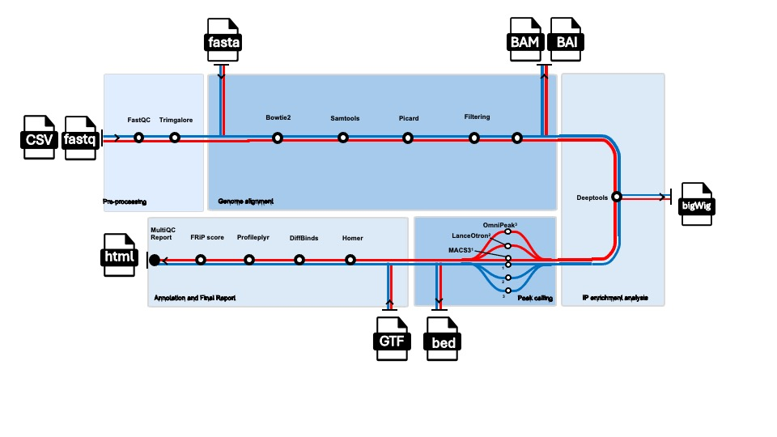

<h1>
  <picture>
    
  </picture>
</h1>

# CATP3ak: ChIP-Seq and ATAC-Seq callpeakers

A Nextflow DSL2 pipeline for comprehensive ATAC-seq and ChIP-seq data analysis.

CATP3ak was developed to improve peak identification by integrating multiple complementary peak-calling approaches within a single reproducible workflow. Starting from raw sequencing data, the pipeline performs quality control, preprocessing, alignment, duplicate removal, blacklist filtering, peak calling, annotation, differential binding analysis, signal profiling, and reporting.

By combining statistical, deep-learning, and Hidden Markov Model-based approaches, the integrated application of these tools significantly improves precision and accuracy in peak calling.

[](https://www.nextflow.io/)
[](https://www.docker.com/)

---

## Overview & Peak Calling Methodologies

Analysis of ATAC- and ChIP-Seq data is often complex due to the large number of candidate peaks assessed during peak calling, where noise, inter-sample biological variation, and overlapping signals can reduce accuracy.
CATP3ak is a modular workflow designed for both ChIP-seq and ATAC-seq experiments to overcome these issues by integrating three complementary peak-calling algorithms:

1. **MACS3 (Statistical Modeling):** The gold standard for ChIP-seq. 
   * *Single Mode:* Calls peaks for each individual replicate.
   * *Grouped Mode:* Automatically handles control sample pairing and pools replicates belonging to the same biological group to build a robust consensus peakset.
2. **LanceOtron (Deep Learning):** Utilizes neural networks to recognize and extract peak shapes, drastically reducing false positives and identifying low-intensity peaks frequently missed by standard filtering methods.
3. **OmniPeak (Hidden Markov Models):** A powerful peak caller based on Hidden Markov Models (HMM) designed to identify signals independently of their shape, helping to capture low-intensity peaks.

By combining statistical modeling, neural networks, and HMM-based approaches, the integrated application of these tools significantly improves precision, accuracy, reproducibility, and overall confidence in peak calling while reducing background noise and false positives.

---

## Features

* ChIP-seq and ATAC-seq support
* Automatic Single-End / Paired-End detection
* Automatic control sample identification
* Quality control with FastQC
* Adapter trimming with Trim Galore
* Alignment using Bowtie2
* BAM processing with SAMtools
* Duplicate removal with Picard
* Blacklist filtering
* BigWig signal track generation
* **Multi-strategy peak calling** (MACS3 Single/Grouped, LanceOtron, OmniPeak)
* FRiP score calculation
* Peak annotation with HOMER
* Differential binding analysis with DiffBind
* Signal profiling with Profileplyr
* Comprehensive MultiQC reporting
* Docker and AWS/S3 compatibility through `nf-amazon`

---

## Workflow

<p align="center">
  
</p>

---

## Requirements

* Nextflow ≥ 25.x
* Docker

Verify installation:

```bash
nextflow -version
docker --version
```

---

## Quick Start

Run the pipeline directly from GitHub:

```bash
nextflow run apgrimaldi/CATP3ak \
    -latest \
    -profile docker \
    --input samplesheet.csv \
    --protocol chip \
    --genome GRCh38 \
    --chrom_sizes path/to/hg38.chrom.sizes \
    --outdir results
```

---

## Main Parameters

| Parameter                | Description                                       |
| ------------------------ | ------------------------------------------------- |
| `--input`                | Input samplesheet                                 |
| `--protocol`             | Analysis type (`chip` or `atac`)                  |
| `--genome`               | Genome identifier                                 |
| `--outdir`               | Output directory                                  |
| `--fragment_size`        | Fragment size used for single-end analyses        |
| `--single_end`           | Force single-end processing                       |
| `--lanceotron_threshold` | Minimum Lanceotron score retained after filtering |
| `--skip_homer`           | Skip HOMER annotation                             |
| `--skip_diffbind`        | Skip DiffBind analysis                            |
| `--skip_profileplyr`     | Skip Profileplyr analysis                         |
| `--skip_omnipeak`        | Skip Omnipeak analysis                            |

---

## Custom Genome Support

CATP3ak supports custom reference genomes.

### Parameters

| Parameter         | Description                           |
| ----------------- | ------------------------------------- |
| `--reference_file`| Reference genome FASTA file           |
| `--gtf_file`      | Gene annotation GTF file              |
| `--macs_gsize`    | Effective genome size for MACS3       |
| `--blacklist`     | BED file containing blacklist regions |
| `--bowtie2_index` | Pre-built Bowtie2 index               |
| `--chrome_sizes`  | Chromosome sizes for Omnipeak         |
### Example

```bash
nextflow run apgrimaldi/CATP3ak \
    -profile docker \
    --protocol chip \
    --input samplesheet.csv \
    --reference_file reference.fasta \
    --gtf_file annotation.gtf \
    --chrom_sizes hg38.chrom.sizes \
    --macs_gsize 2.7e9 \
    --blacklist blacklist.bed \
    --outdir results \
    -resume
```

---

## Input Samplesheet

### ChIP-seq Example

```csv
sample,fastq_1,fastq_2,antibody,control,group
IP_gH2AX_DOXO_1,data/IP_gH2AX_DOXO_1.fastq.gz,,gH2AX,IP_IgG_DOXO_1,DOXO
IP_IgG_DOXO_1,data/IP_gH2AX_DOXO_1.fastq.gz,,gH2AX,,DOXO
```

### ATAC-seq Example

```csv
sample,fastq_1,fastq_2,antibody,control,group
ATAC_1,data/ATAC_1_R1.fastq.gz,data/ATAC_1_R2.fastq.gz,ATAC,,
ATAC_2,data/ATAC_2_R1.fastq.gz,data/ATAC_2_R2.fastq.gz,ATAC,,
```

### Samplesheet Columns

| Column       | Description                                         |
| ------------ | --------------------------------------------------- |
| `sample`     | Unique sample identifier                            |
| `fastq_1`    | Read 1 FASTQ file                                   |
| `fastq_2`    | Read 2 FASTQ file (leave empty for Single-End data) |
| `antibody`   | Antibody name (ChIP-seq only)                       |
| `control`    | Matching control sample                             |
| `group`      | Matching group sample                               |


---

## Automatic Control Detection

For ChIP-seq analyses, CATP3ak automatically identifies control samples using one or more of the following criteria:

1. The sample is referenced in the `control` column.
2. The antibody is specified as `IgG`.
3. The `is_control` column is set to `true`.

No control detection is performed in ATAC-seq mode.

---

## Output Structure

```text
results/
├── 00_genome_index/
├── 01_fastqc/
├── 02_trimmed/
├── 03_aligned/
│   ├── raw_bam/
│   ├── sorted_bam/
│   ├── indexed_sorted_bam/
│   └── stats/
├── 04_duplicates_removed/
├── 05_final_filtered_bam/
├── 06_bigwig/
│   └── qc_fingerprint/
├── 07_lanceotron/
│   ├── unfiltered/
│   ├── filtered/
│   └── bigwig_res1/
├── 08_peaks_macs3/
│   ├── narrow/
│   ├── broad/
│   └── frip_stats/
├── 09_omnipeak/
├── 10_annotation/
│   ├── macs/
│   ├── lanceotron/
│   └── omnipeak/
├── 11_diffbind/
│   ├── macs/
│   ├── lanceotron/
│   └── omnipeak/
├── 12_profileplyr/
│   ├── macs/
│   └── lanceotron/
└── 13_MultiQC_Report/
```

---

## Generated Outputs

CATP3ak produces a comprehensive set of results designed for both immediate biological interpretation and further computational analysis:

* **Quality-control reports:** FastQC and Trim Galore metrics evaluating raw read quality, adapter trimming efficiency, and sequence duplication levels.
* **Filtered BAM files:** Sorted and indexed alignment files processed to remove PCR duplicates (Picard) and artifact-prone blacklisted regions, ready for downstream analysis.
* **BigWig tracks for genome browsers:** Normalized, continuous coverage files (`.bw` generated by deepTools) optimized for visual inspection on IGV or UCSC Genome Browser.
* **MACS3 peaks (narrow and broad):** High-confidence binding sites identified statistically, outputting both single-replicate peaks and highly robust *Grouped* consensus peaks in standard BED/narrowPeak formats.
* **LanceOtron peaks (raw and filtered):** Deep learning-evaluated peaks containing neural network confidence scores, accompanied by a filtered dataset based on the user-defined threshold.
* **OmniPeak results:** Hidden Markov Model-derived peaks, highly effective at capturing both sharp transcription factor binding and broad histone mark profiles.
* **FRiP statistics:** "Fraction of Reads in Peaks" calculations providing a crucial metric to assess the overall signal-to-noise ratio and success of the immunoprecipitation.
* **HOMER annotations:** Detailed genomic feature mapping that associates each identified peak with its nearest gene, promoter, intron, or exon.
* **DiffBind differential binding results:** Quantitative output (CSV format) identifying genomic regions with statistically significant changes in binding intensity between experimental conditions.
* **Profileplyr signal profiling reports:** Heatmaps and read density profiles plotted around peak centers, offering a clear visual comparison of binding dynamics.
* **MultiQC summary report:** An interactive, all-in-one HTML dashboard aggregating logs and metrics from every step of the pipeline for rapid experiment evaluation. 
---

## Reproducibility

All software dependencies are executed within containers, ensuring reproducible analyses across different computational environments.

Supported execution environments:

* Docker
* AWS-compatible infrastructures

---

## Author

**Annapaola Grimaldi**

Laboratory of Molecular Medicine and Genomics, Department of Medicine, Surgery and Dentistry "Scuola Medica Salernitana", University of Salerno, 84081, Baronissi, SA, Italy.

GitHub: https://github.com/apgrimaldi

